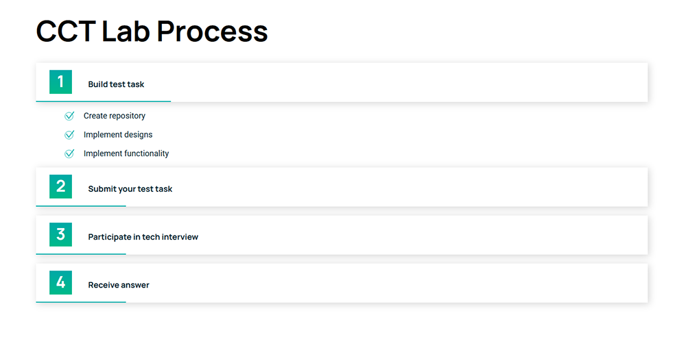

<h1 align="center"> CCT Task</h1>

<p align="center">Implementaion of a given design: collapsibles created using React.js.</p>


[](https://briedyte.github.io/cct-task/) https://briedyte.github.io/cct-task/

[](https://briedyte.github.io/cct-task/)

---

## Installation

**Run following commands in root folder of the app**

1. to install node_modules:
   ```al
   $ npm install
   ```
2. to run app in development mode:
   ```al
   $ npm start
   ```

Open http://localhost:3000 to view it in browser.

---

_**Task provided by:** [Corner Case Technologies](https://www.cornercasetech.com/)_

_**Task completed by:** [Emilija Briedytė](https://github.com/Briedyte)_
